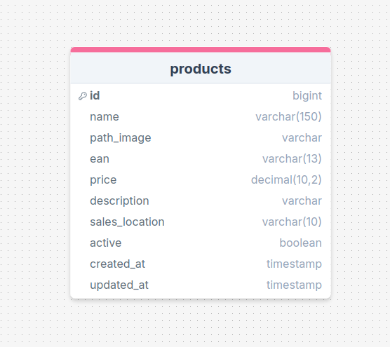

# API de Cadastro de Produtos 📦

## Descrição

Esta API foi desenvolvida utilizando **FastAPI** para gerenciar o cadastro de produtos, permitindo realizar operações como criação, consulta, atualização e validação de produtos.

O frontend que consome essa API está disponível no repositório [**LuizaLabs Frontend**](https://github.com/HugooSantos/luizaLabs-frontend).

## Estrutura do Banco de Dados 🗄️

Abaixo, a estrutura do banco de dados que foi utilizada no projeto.




### Tabela: products

- **id** (integer) - Chave primária, autoincremento.
- **name** (varchar(150)) - Nome do produto.
- **path_image** (varchar) - Caminho da imagem do produto.
- **ean** (varchar(13)) - Código EAN único do produto.
- **price** (float) - Preço do produto.
- **description** (varchar(250)) - Descrição do produto.
- **sales_location** (varchar(10)) - Localização de venda.
- **active** (boolean) - Indica se o produto está ativo ou não.
- **created_at** (timestamp) - Data de criação do registro.
- **updated_at** (timestamp) - Data da última atualização do registro.

## Tecnologias e Bibliotecas Utilizadas 🛠️

As principais tecnologias e bibliotecas utilizadas são:

- **FastAPI**: Framework para construção de APIs RESTful.
- **Uvicorn**: Servidor ASGI para executar a aplicação.
- **SQLAlchemy**: ORM para interagir com o banco de dados.
- **Psycopg2-binary**: Conector PostgreSQL para Python.
- **Pydantic**: Para validação de dados de entrada e saída.
- **Python-dotenv**: Carrega variáveis de ambiente a partir de um arquivo .env.
- **Python-multipart**: Manipulação de arquivos, como uploads de imagens.
- **Pillow**: Biblioteca para manipulação de imagens.
- **SQLAlchemy-Utils**: Ferramentas adicionais para SQLAlchemy.
- **Starlette**: Framework para a criação de aplicações web assíncronas.
- **Dotenv**: Carrega variáveis de ambiente a partir de um arquivo `.env`.
- **Alembic**: Ferramenta de migração de banco de dados para SQLAlchemy.
- **PostgreSQL 15**: Foi o banco de dados proposto para essa API.


### Explicação da Estrutura de pastas 📂

- **api/**: Contém o código principal da aplicação, incluindo a inicialização do FastAPI, modelos do banco de dados, controladores de endpoints e lógica de negócio.
  - **main.py**: Onde a aplicação FastAPI é configurada e os endpoints são definidos.
  - **models.py**: Define os modelos do banco de dados, usando SQLAlchemy.
  - **schemas.py**: Contém os schemas do Pydantic para validação de dados. É utilizado para garantir que as requisições e respostas estejam no formato correto.
  - **services/**: Contém a lógica de negócios para manipulação de dados, como a criação, atualização produtos entre outros.
  - **routers/**: Define os controladores que implementam as rotas da API.
  - **utils/**: Funções auxiliares para tarefas complementares.
  - **repositories/**: Contém as classes responsáveis pela interação direta com o banco de dados. A camada de repositório abstrai as consultas e operações no banco.
- **migrations/**: Contém os arquivos de migração do banco de dados gerados pelo Alembic.
- **.env**: Armazena variáveis de ambiente, como a URL do banco de dados e chaves secretas.  
- **requirements.txt**: Arquivo que contém as dependências do projeto.

## Funcionalidades ⚙️

Esta API oferece os seguintes endpoints:

- **Criar Produto**: Adiciona um novo produto ao banco de dados.
- **Buscar Produtos Paginados**: Retorna uma lista de produtos com base na paginação fornecida. A resposta inclui os dados dos produtos e informações sobre a página atual, como o número total de produtos e a quantidade por página. Ideal para exibir grandes volumes de dados de forma eficiente.
- **Consultar Produto**: Busca um produto pelo ID.
- **Atualizar Produto**: Atualiza as informações de um produto existente.
- **Criar Imagem**: Cria uma nova imagem para um produto existente, associando-a ao produto.
- **Deletar Imagem**: Remove a imagem associada a um produto existente.
- **Buscar Imagem**: Recupera a imagem associada a um produto existente.
- **Validar EAN**: Valida o código EAN de um produto, verificando se ele já existe no banco de dados. Retorna um status 204 (No Content) se a validação for bem-sucedida.

## Como Executar 🏃‍♂️
    
1. **Clonar e Instalar Dependências**
    
    via ssh:
    ```bash
    git clone git@github.com:HugooSantos/luizaLabs-api.git
    ```
    via https:

    ```bash
    git clone https://github.com/HugooSantos/luizaLabs-api.git
    ```
    
    entre no diretorio:

    ```bash
    cd luizaLabs-api
    ```

2. **Configurar Variáveis de Ambiente**: 

   Copie o arquivo .env.example para um novo arquivo .env e adicione as informações do seu banco de dados:
   ```bash
   cp .env.example .env
   ```

   No arquivo .env, adicione as variáveis do seu banco de dados:
   ```bash
   POSTGRES_USER=seu_usuario
   POSTGRES_PASSWORD=sua_senha
   POSTGRES_DB=nome_do_banco
   POSTGRES_HOST=localhost
   POSTGRES_PORT=sua porta (normalmente é 5432) 
   ```

3. **Instalar Dependências**:

   - Primeiro, crie e ative seu ambiente virtual:

    **No Windows**:
    ```bash
    python -m venv venv
    .\venv\Scripts\activate
    ```
    **No macOS/Linux**:
    ```bash
    python3 -m venv venv
    source venv/bin/activate
    ```
    - instale as Dependências

    ```bash
    pip install -r requirements.txt
    ```

    agora rode: 
    ```bash
    python create_database.py
    ```
    
    Aqui você criara o seu banco de dados.

    -logo após faça os passos abaixo dentro do seu ambiente virtual:
  
4. **Rodar as Migrations**: 
   - Execute as migrations do Alembic para configurar o banco de dados:

   ```bash 
   alembic upgrade head
   ```

5. **Ver Openapi**: 
    
   - Para ver o seu openapi rode no terminal com a venv ativa

    ```bash 
    uvicorn api.main:app --reload
    ```
   - acesse:

    ```bash 
    http://localhost:8000/docs
    ```